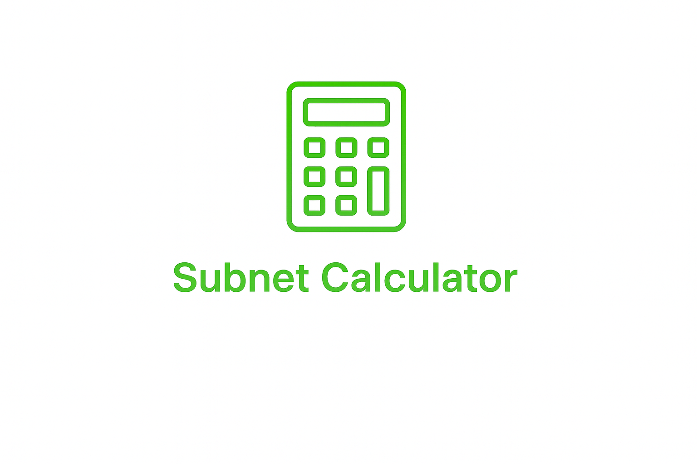

# 🟢 Jhonnyfolio

### Personal Portfolio • Angular • TypeScript

Portfolio personale sviluppato con **Angular**, progettato per raccogliere informazioni personali, competenze, progetti e strumenti sviluppati durante il percorso di apprendimento e sviluppo web.

Il progetto include anche un'**area amministrativa protetta**, un backend REST con **Node.js + Express** e un database **SQLite** per la gestione degli account.

---

<div align="center">


</div>

---

## 📖 Descrizione

**Jhonnyfoliio** è la versione Angular del mio portfolio personale.

L'applicazione è stata sviluppata con l'obiettivo di approfondire Angular e trasformare un sito web esistente in un'applicazione strutturata attraverso **componenti, servizi, routing, Reactive Forms, Signals e comunicazione HTTP**.

Il progetto non si limita alla semplice presentazione del portfolio: comprende anche funzionalità interattive, una piccola infrastruttura backend per la gestione dell'area amministrativa e una sezione e-commerce con carrello.

---

## ✨ Funzionalità

### 🌐 Portfolio

La parte pubblica del sito comprende:

* Hero section
* Presentazione personale
* Competenze
* Portfolio dei progetti
* Form di contatto
* Footer
* Navigazione responsive

### 🔐 Area Admin

L'area amministrativa è disponibile tramite:

```text
/admin
```

ed è protetta da un `authGuard`.

Sono disponibili:

* Login
* Visualizzazione degli account
* Creazione di nuovi account
* Eliminazione degli account
* Modifica della password
* Logout

La gestione degli account comunica direttamente con il backend REST.

### 🛒 Shop e carrello

La sezione e-commerce è disponibile tramite:

```text
/shop
```

Include:

* visualizzazione dei prodotti;
* pagina di dettaglio del prodotto;
* aggiunta e rimozione di articoli dal carrello;
* calcolo automatico del totale;
* collegamenti rapidi al carrello dalla pagina shop e dal dettaglio prodotto;
* inserimento di prodotti dall'area admin.

Prodotti e carrello usano Angular Signals per lo stato reattivo. Al momento i dati sono mantenuti in memoria: un refresh della pagina azzera il contenuto del carrello e i prodotti aggiunti.

### 🎮 Dex Debolezze Pokémon

Il progetto include una Dex dedicata alle interazioni tra i tipi Pokémon.

Sono presenti tutti i **18 tipi Pokémon** con informazioni relative a:

* debolezze;
* attacchi efficaci;
* attacchi poco efficaci;
* immunità;
* resistenze.

È inoltre presente una ricerca dinamica che permette di filtrare i tipi disponibili.

### 📬 Form di contatto

Il modulo di contatto utilizza **Angular Reactive Forms** e gestisce:

* nome;
* email;
* oggetto;
* messaggio.

L'invio dei dati viene effettuato tramite **Formspree**.

---

## 🛠️ Stack tecnologico

### Frontend

| Tecnologia       | Utilizzo                    |
| ---------------- | --------------------------- |
| Angular 22       | Framework frontend          |
| TypeScript 6     | Linguaggio principale       |
| HTML5            | Struttura                   |
| CSS3             | Styling e responsive design |
| RxJS             | Programmazione reattiva     |
| Angular Router   | Routing                     |
| Reactive Forms   | Form e validazione          |
| Signals          | Stato reattivo              |
| Computed Signals | Filtraggio dinamico         |

### Backend

| Tecnologia     | Utilizzo                       |
| -------------- | ------------------------------ |
| Node.js        | Runtime backend                |
| Express 5      | REST API                       |
| SQLite         | Database                       |
| better-sqlite3 | Accesso al database            |
| bcrypt         | Hash delle password            |
| CORS           | Comunicazione frontend/backend |

### Servizi esterni

* **Formspree** — gestione del modulo di contatto.

---

## 🧩 Architettura

Il progetto è organizzato separando le principali funzionalità in componenti Angular dedicati.

```text
src/
└── app/
    ├── about/
    ├── competenze/
    ├── contatti/
    ├── dex/
    ├── footer/
    ├── hero/
    ├── home-c/
    ├── navbar/
    ├── pages/
    │   ├── admin/
    │   │   ├── guards/
    │   │   └── login/
    │   └── shop/
    │       ├── carrello/
    │       ├── productcard/
    │       └── productdetail/
    └── proggetti/
```

### Componenti principali

| Cartella      | Responsabilità                |
| ------------- | ----------------------------- |
| `about/`      | Presentazione personale       |
| `pages/admin/` | Gestione area amministrativa |
| `competenze/` | Competenze tecniche           |
| `contatti/`   | Form di contatto              |
| `dex/`        | Dex delle interazioni Pokémon |
| `footer/`     | Footer                        |
| `hero/`       | Hero section                  |
| `home-c/`     | Composizione della homepage   |
| `pages/admin/login/` | Autenticazione          |
| `navbar/`     | Navigazione                   |
| `pages/shop/` | Shop, dettaglio e carrello    |
| `proggetti/`  | Sezione portfolio             |

---

## 📂 Struttura del repository

```text
Website-Angular-main/
│
├── backend/
│   ├── createuser.js
│   ├── database.js
│   ├── server.js
│   ├── package.json
│   └── package-lock.json
│
├── public/
│   ├── DexDebolezze.png
│   ├── calcsubb.png
│   ├── github.png
│   ├── logo.png
│   ├── shopify.png
│   ├── taskmanager.png
│   └── prodotti/
│       ├── mouse.jpeg
│       ├── tastiera.jpeg
│       └── tappetino.jpeg
│
├── src/
│   ├── app/
│   ├── index.html
│   ├── main.ts
│   └── styles.css
│
├── angular.json
├── package-lock.json
├── tsconfig.json
├── tsconfig.app.json
└── tsconfig.spec.json
```

---

## 🚀 Installazione

### Prerequisiti

Prima di iniziare assicurati di avere installato:

* **Node.js**
* **npm**
* **Angular CLI**

### Frontend

Dalla directory principale:

```bash
npm install
```

Avvia l'applicazione in modalità sviluppo:

```bash
npm start
```

Dopodiché apri:

```text
http://localhost:4200
```

> Il progetto utilizza npm come package manager, come configurato in `angular.json`.

---

## ⚙️ Backend

Il backend si trova nella cartella:

```text
backend/
```

Installa le dipendenze:

```bash
cd backend
npm install
```

Avvia il server:

```bash
node server.js
```

Il backend viene eseguito sulla porta:

```text
3000
```

ed è quindi raggiungibile tramite:

```text
http://localhost:3000
```

### Verifica del server

È disponibile un endpoint di test:

```bash
curl http://localhost:3000/ping
```

Risposta:

```json
{
  "message": "pong"
}
```

---

## 🗄️ Database

Il backend utilizza **SQLite** tramite `better-sqlite3`.

Il database contiene la tabella:

```text
users
```

con informazioni relative agli account.

La password non viene memorizzata direttamente: viene generato un hash tramite `bcrypt`.

Il database locale è escluso dal repository tramite `.gitignore`:

```gitignore
**/data.db
```

---

## 🔌 API

Il backend espone le seguenti API:

| Metodo   | Endpoint                    | Descrizione          |
| -------- | --------------------------- | -------------------- |
| `GET`    | `/ping`                     | Verifica del server  |
| `GET`    | `/users`                    | Recupera gli utenti  |
| `POST`   | `/users`                    | Crea un account      |
| `DELETE` | `/users/:username`          | Elimina un account   |
| `PATCH`  | `/users/:username/password` | Modifica la password |
| `POST`   | `/login`                    | Effettua il login    |

---

## 🧭 Routing Angular

Le principali rotte dell'applicazione sono:

| Route    | Descrizione         | Accesso     |
| -------- | ------------------- | ----------- |
| `/`      | Homepage            | Pubblico    |
| `/login` | Login               | Pubblico    |
| `/Dex`   | Dex Debolezze       | Pubblico    |
| `/shop`  | Catalogo prodotti   | Pubblico    |
| `/shop/:id` | Dettaglio prodotto | Pubblico  |
| `/shop/cart` | Carrello          | Pubblico    |
| `/admin` | Area amministrativa | 🔒 Protetto |

La rotta `/admin` utilizza `authGuard` per verificare lo stato di autenticazione prima di consentire l'accesso.

---

## 🔐 Autenticazione

Il sistema di autenticazione utilizza:

```text
Angular
   │
   │ HTTP
   ▼
Express API
   │
   ▼
SQLite
```

Le password vengono protette attraverso:

```text
Password
   │
   ▼
bcrypt
   │
   ▼
Password Hash
   │
   ▼
SQLite
```

Lo stato di autenticazione del frontend viene mantenuto tramite `localStorage`.

> Il progetto attuale non utilizza JWT o sessioni server-side.

---

## 📸 Screenshot

Il repository contiene alcuni screenshot relativi ai progetti presenti nel portfolio.

### Dex Debolezze


### Calcolatore di Subnetting



### Task Manager


---

## 🗺️ Roadmap

### Completato

* [x] Migrazione del portfolio ad Angular
* [x] Organizzazione in componenti
* [x] Angular Router
* [x] Lazy loading dei componenti
* [x] Reactive Forms
* [x] Angular Signals
* [x] Computed Signals
* [x] Form di contatto
* [x] Dex Debolezze
* [x] Ricerca nella Dex
* [x] Login
* [x] `authGuard`
* [x] Backend Express
* [x] API REST
* [x] Database SQLite
* [x] Hash delle password con bcrypt
* [x] Creazione account
* [x] Eliminazione account
* [x] Modifica password
* [x] Visualizzazione degli account
* [x] Shop e dettaglio prodotto
* [x] Carrello con totale e rimozione articoli
* [x] Inserimento prodotti dall'area admin

### 🔜 Possibili sviluppi

* [ ] Modifica dello username degli account
* [ ] Miglioramento della gestione degli errori
* [ ] Evoluzione del sistema di autenticazione
* [ ] Ulteriori funzionalità per l'area amministrativa
* [ ] Persistenza di prodotti e carrello nel backend/database

---

## ⚠️ Known Issues

### Autenticazione locale

Lo stato di autenticazione viene mantenuto tramite `localStorage`.

Questo sistema è adatto al progetto attuale, ma può essere ulteriormente evoluto per utilizzare un sistema di autenticazione più robusto.

### Gestione degli errori

Alcune operazioni utilizzano ancora messaggi semplici e `console.log` per comunicare gli errori. La gestione degli errori può quindi essere ulteriormente migliorata.

---

## 🤝 Contributi

Il progetto nasce principalmente come portfolio personale e progetto di apprendimento.

Eventuali contributi possono essere proposti tramite Pull Request.

### Workflow consigliato

```bash
git clone <repository-url>
cd Website-Angular-main

git checkout -b feature/nome-feature

# modifica il progetto

git add .
git commit -m "feat: descrizione della modifica"
git push origin feature/nome-feature
```

Successivamente è possibile aprire una Pull Request.

---

## 📄 Licenza

Non è presente una licenza esplicita nel repository attuale.

---

## 👤 Autore

**Jhonny**

Portfolio personale e progetto di apprendimento dedicato allo sviluppo web con Angular e TypeScript.

---

<div align="center">

### 🟢 Jhonnyfoliio

**Built with Angular & TypeScript**

</div>
